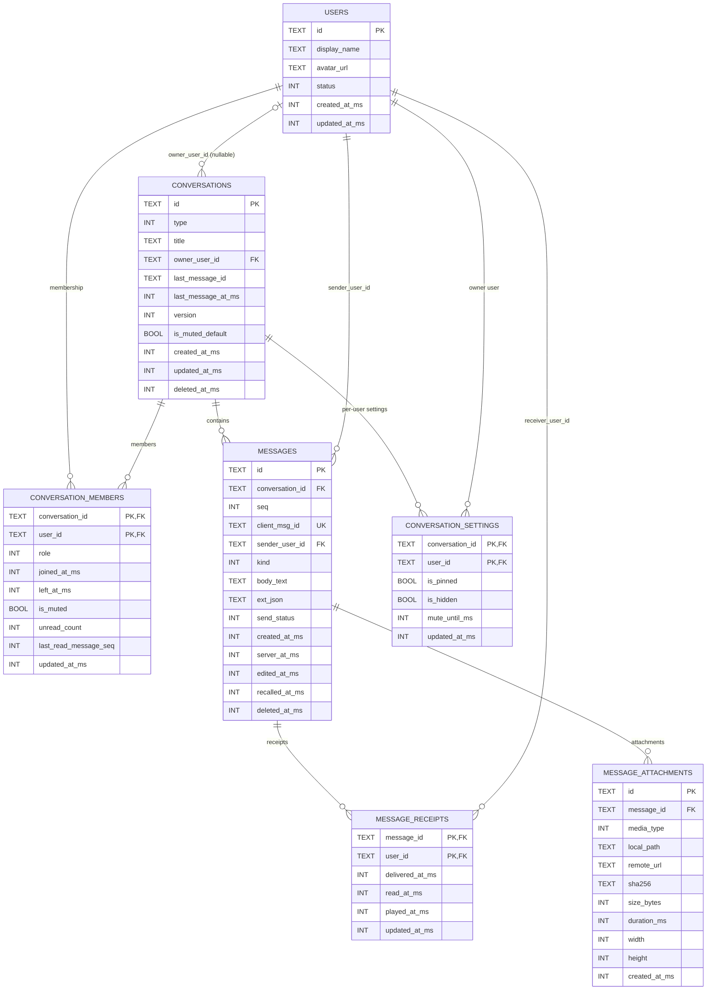

# GRDB 表关系图（ER）

本文档基于当前 `Migrations.swift` 的真实结构整理，用于快速查看表之间的主外键关系与级联策略。

## 1. Mermaid ER 图

## 2. 关键外键删除策略

- `conversations.owner_user_id -> users.id`: `ON DELETE SET NULL`
- `conversation_members.conversation_id -> conversations.id`: `ON DELETE CASCADE`
- `conversation_members.user_id -> users.id`: `ON DELETE CASCADE`
- `messages.conversation_id -> conversations.id`: `ON DELETE CASCADE`
- `messages.sender_user_id -> users.id`: `ON DELETE RESTRICT`
- `message_receipts.message_id -> messages.id`: `ON DELETE CASCADE`
- `message_receipts.user_id -> users.id`: `ON DELETE CASCADE`
- `message_attachments.message_id -> messages.id`: `ON DELETE CASCADE`
- `conversation_settings.conversation_id -> conversations.id`: `ON DELETE CASCADE`
- `conversation_settings.user_id -> users.id`: `ON DELETE CASCADE`

## 3. 表格版关系总览

| 子表 | 子表字段 | 父表 | 父表字段 | 基数 | ON DELETE | 说明 |
|---|---|---|---|---|---|---|
| `conversations` | `owner_user_id` | `users` | `id` | N:1 | `SET NULL` | 群主/会话所有者可为空 |
| `conversation_members` | `conversation_id` | `conversations` | `id` | N:1 | `CASCADE` | 会话删除后成员关系自动清理 |
| `conversation_members` | `user_id` | `users` | `id` | N:1 | `CASCADE` | 用户删除后成员关系自动清理 |
| `messages` | `conversation_id` | `conversations` | `id` | N:1 | `CASCADE` | 会话删除后消息自动清理 |
| `messages` | `sender_user_id` | `users` | `id` | N:1 | `RESTRICT` | 防止误删发送者导致消息孤儿 |
| `message_receipts` | `message_id` | `messages` | `id` | N:1 | `CASCADE` | 消息删除后回执自动清理 |
| `message_receipts` | `user_id` | `users` | `id` | N:1 | `CASCADE` | 用户删除后回执自动清理 |
| `message_attachments` | `message_id` | `messages` | `id` | N:1 | `CASCADE` | 消息删除后附件元数据自动清理 |
| `conversation_settings` | `conversation_id` | `conversations` | `id` | N:1 | `CASCADE` | 会话删除后置顶/隐藏配置清理 |
| `conversation_settings` | `user_id` | `users` | `id` | N:1 | `CASCADE` | 用户删除后个性化配置清理 |

## 4. 主键与唯一约束（摘要）

| 表 | 主键 | 关键唯一约束 |
|---|---|---|
| `users` | `id` | - |
| `conversations` | `id` | - |
| `conversation_members` | `(conversation_id, user_id)` | - |
| `messages` | `id` | `client_msg_id`、`(conversation_id, seq)` |
| `message_receipts` | `(message_id, user_id)` | - |
| `message_attachments` | `id` | - |
| `conversation_settings` | `(conversation_id, user_id)` | - |

